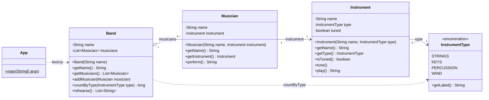

# Diagram klas

```mermaid
classDiagram
    direction LR

    class App {
        +main(String[] args)$
    }

    class Band {
        -String name
        -List~Musician~ musicians
        +Band(String name)
        +getName() String
        +getMusicians() List~Musician~
        +addMusician(Musician musician)
        +countByType(InstrumentType type) long
        +rehearse() List~String~
    }

    class Musician {
        -String name
        -Instrument instrument
        +Musician(String name, Instrument instrument)
        +getName() String
        +getInstrument() Instrument
        +perform() String
    }

    class Instrument {
        -String name
        -InstrumentType type
        -boolean tuned
        +Instrument(String name, InstrumentType type)
        +getName() String
        +getType() InstrumentType
        +isTuned() boolean
        +tune()
        +play() String
    }

    class InstrumentType {
        <<enumeration>>
        STRINGS
        KEYS
        PERCUSSION
        WIND
        +getLabel() String
    }

    App ..> Band : tworzy
    Band "1" o-- "0..*" Musician : musicians
    Musician "1" --> "1" Instrument : instrument
    Instrument "0..*" --> "1" InstrumentType : type
    Band ..> InstrumentType : countByType
```
